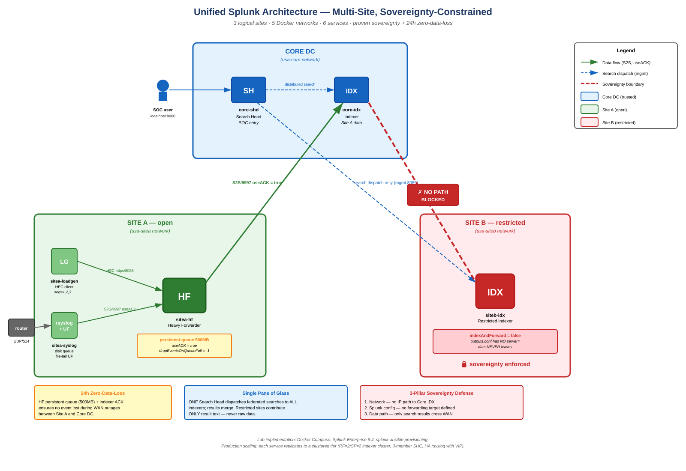

# Unified Splunk Architecture — Multi-Site Lab


## Architecture



The lab implements three logical sites with five Docker networks modelling
trust boundaries. Source: [`docs/architecture.drawio`](docs/architecture.drawio)
(open in https://app.diagrams.net).

A Docker Compose lab that demonstrates the case study **"Unified Splunk
Architecture for a Multi-Site, Sovereignty-Constrained Organization"**.

## What this lab proves

| Case study requirement | How this lab demonstrates it |
|---|---|
| **Single Pane of Glass** | One Search Head dispatches federated search across all sites simultaneously |
| **Data Sovereignty (Sites B & D)** | Site B indexer is on an isolated Docker network — raw data never leaves; only search results return |
| **Zero Data Loss for 24h** | Site A Heavy Forwarder uses persistent queue + indexer ACK; survives WAN outages |
| **Syslog reliability** | Dedicated rsyslog tier with disk-assisted queue, file-tail by UF (eliminates UDP loss) |
| **Configuration as Code** | All `.conf` files in Git, GitHub Actions CI lints + dry-runs before deploy |

## Scope: faithful to architecture, scaled for laptop

| Production | This Lab |
|---|---|
| 6 sites (A, B, C, D, E, F) | 3 representative sites (Core DC, Site A open, Site B restricted) |
| Indexer Cluster (RF=2/SF=2, 3+ peers per site) | 1 indexer per site (single peer) |
| Search Head Cluster (3 members + Deployer) | 1 search head |
| Production WAN | Docker bridge networks simulating WAN |

> **For interviewers:** every container in this compose file represents a
> tier that scales horizontally in production by adjusting the `replicas`
> field or duplicating the service block. The architectural pattern is
> identical at any scale.

## Prerequisites

- **Docker Desktop** (or Docker Engine + Compose v2) — Linux/macOS/Windows
- **8 GB RAM** minimum (12 GB recommended for Day 2+)
- **20 GB free disk space** (for Splunk volumes)
- **Internet access** (for pulling the Splunk image, ~2 GB)

## Quick start (Day 1)

```bash
# Clone or unzip into a working directory
cd unified-splunk-architecture

# Start the stack (first run takes ~10 minutes — pulls image + initial Splunk setup)
chmod +x scripts/*.sh
./scripts/start.sh

# Wait ~3 minutes after containers report "healthy", then validate
./scripts/verify.sh
```

If `verify.sh` shows all green checkmarks, your foundation is solid and
you're ready for Day 2.

### Access points

| URL | Role | Login |
|---|---|---|
| http://localhost:8000 | Core Search Head — SOC entry point | `admin` / see `.env` |
| http://localhost:8001 | Core Indexer — admin only | `admin` / see `.env` |
| http://localhost:8002 | Site B Indexer — admin only | `admin` / see `.env` |

## Architecture (current state — Day 1)

```
                        ┌─────────────────────────────┐
                        │      CORE DC                │
                        │                             │
                        │  ┌────────────┐             │
        SOC user ──────►│  │  core-shd  │             │
        (port 8000)     │  │   (SH)     │             │
                        │  └─────┬──────┘             │
                        │        │ distributed search │
                        │        ├──────────┐         │
                        │        ▼          │         │
                        │  ┌────────────┐   │         │
                        │  │  core-idx  │   │         │
                        │  │  (Indexer) │   │         │
                        │  └────────────┘   │         │
                        └───────────────────┼─────────┘
                                            │
                                  wan-net   │ (mgmt 8089 only)
                                            │
                        ┌───────────────────┼─────────┐
                        │      SITE B       │         │
                        │   (Restricted)    ▼         │
                        │              ┌────────────┐ │
                        │              │ siteb-idx  │ │
                        │              │ (Indexer)  │ │
                        │              └────────────┘ │
                        │  ◄── data NEVER leaves ──►  │
                        └─────────────────────────────┘
```

## Project layout

```
unified-splunk-architecture/
├── docker-compose.yml         # The orchestration definition
├── .env.example               # Environment variables template
├── .env                       # Your local config (gitignored)
├── .gitignore
├── README.md                  # This file
├── docs/
│   ├── architecture.md        # Design decisions & rationale
│   └── day1-checklist.md      # Step-by-step Day 1 walkthrough
├── scripts/
│   ├── start.sh               # Bring stack up
│   ├── stop.sh                # Stop containers (preserves data)
│   ├── reset.sh               # Full teardown (deletes data)
│   └── verify.sh              # Day 1 acceptance tests
├── apps/                      # (Day 3) Splunk apps for index/inputs config
├── deployment-apps/           # (Day 3) Apps deployed via Deployment Server
└── cluster-bundle/            # (Day 3) Apps deployed via Cluster Manager
```

## Roadmap

| Day | Deliverable |
|---|---|
| **Day 1** ✅ | Foundation: 3 containers healthy, distributed search across both indexers |
| **Day 2** | Sovereignty enforcement (network + outputs.conf) + Site A HF with persistent queue |
| **Day 3** | Syslog tier (rsyslog disk-assisted queue + UF) + GitHub Actions CI/CD |
| **Day 4** | Demo dashboard, architecture diagram, presentation runbook, dry runs |

## Troubleshooting

**Containers stuck in `health: starting`**
Splunk takes ~3 minutes to fully initialize on first run (Ansible
provisioning runs internally). Be patient. If it's been >10 minutes,
check `docker compose logs core-shd`.

**`verify.sh` says peers not registered**
Splunk Ansible adds peers at startup. If the SH started before the IDXs
were ready, peers may be missing. Restart the SH only:
```bash
docker compose restart core-shd
```

**Out of memory**
Lower the `memory` limit in `docker-compose.yml`, or stop other
applications. Each Splunk container needs ~1.5 GB minimum.

**Port conflicts (8000, 8089, 9997 already in use)**
Edit the `ports:` section in `docker-compose.yml` to use different host
ports (e.g. `9000:8000` instead of `8000:8000`).

## License & legal

This lab uses **Splunk Enterprise Trial** (60-day full feature). The Splunk
software is subject to the [Splunk General Terms](https://www.splunk.com/en_us/legal/splunk-general-terms.html).
By starting the containers, you accept these terms.
